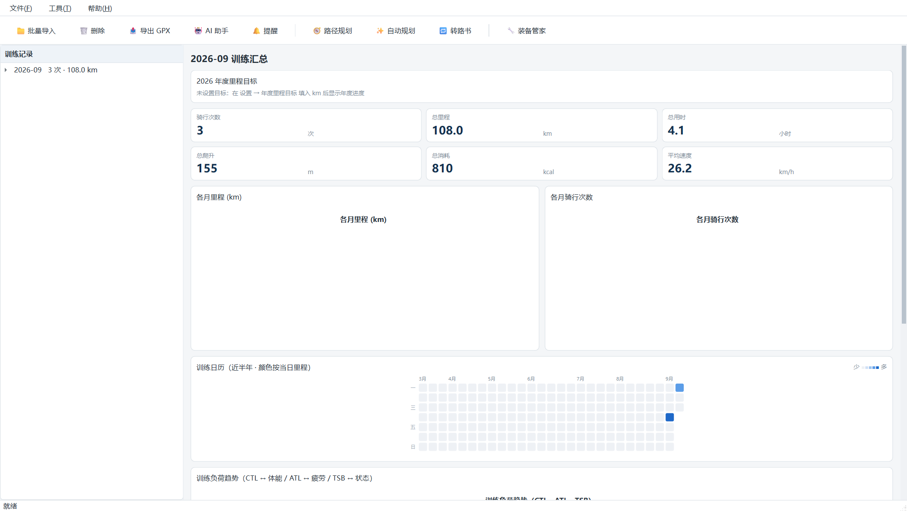
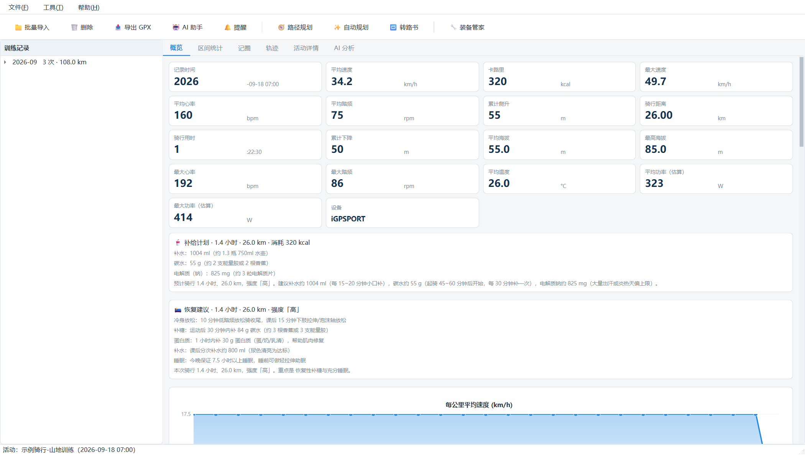
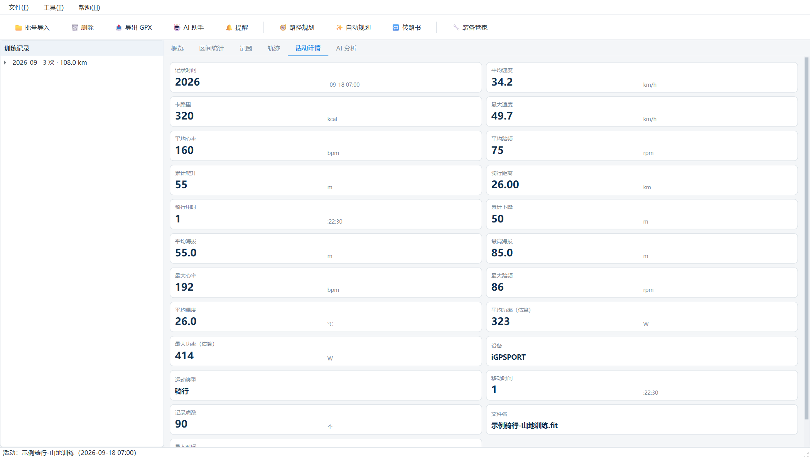
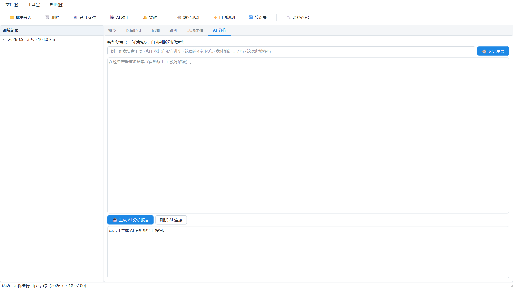
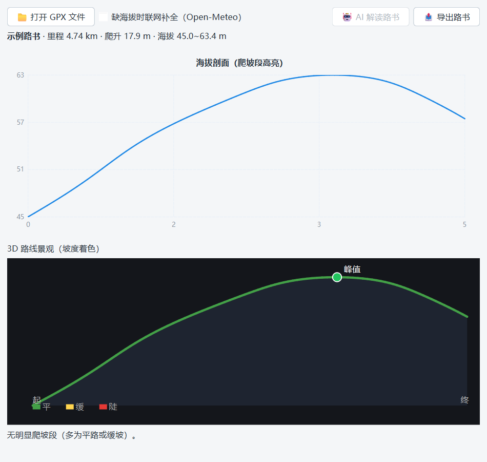
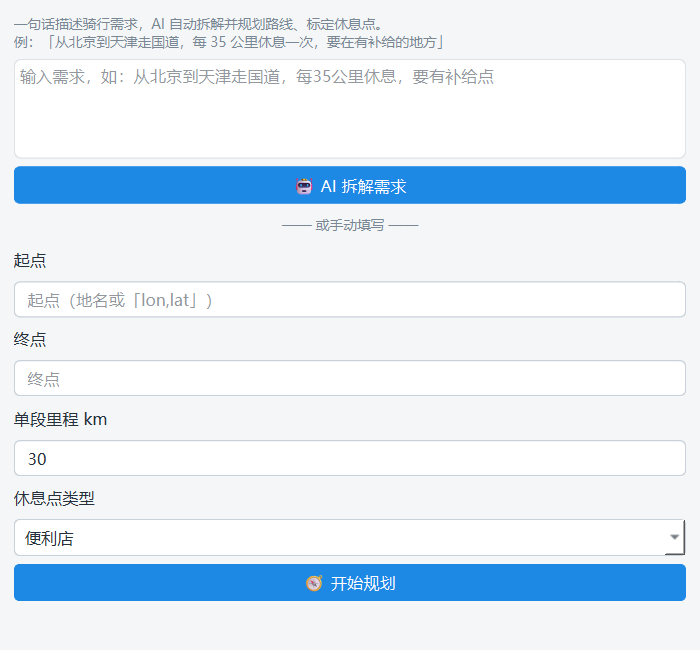

# 🚴 骑行FIT数据分析器（Fit Analyzer）
 [EN](/README_EN.md) · [中文](/README.md) 

免费、本地运行的**骑行 FIT 数据离线分析软件**（纯桌面 Windows 应用，PySide6 原生界面，无浏览器、无本地服务），参考 Garmin Connect / 行者 的骑行数据分析功能：

- **纯桌面图形界面**（原生窗口），**批量导入**码表导出的 `.fit` 文件（iGPSPORT / Garmin / 行者等主流设备），SQLite 本地存储，支持**拖拽 .fit 文件进窗口直接导入**
- 单条活动显示：**记录时间、平均速度、卡路里、最大速度、平均心率、平均踏频、累计爬升** 等 16+ 项指标
- **速度按公里折线图**、**速度区间统计**、**心率统计与心率区间**、**踏频统计与踏频区间**、**海拔统计**、**设备温度统计**
- **记圈（赛段）数据详情**、**活动详情全部字段**
- **运动轨迹图**：高德在线地图（可选）或固定背景图片 + 轨迹叠加（起终点标记、海拔范围）
- **按月汇总统计**：各月次数/里程/用时/爬升/消耗，跨月折线图
- **年度里程目标**：设置目标后，月度页顶部显示进度条与日均缺口
- **训练日历热力图**：近半年按日里程着色（GitHub 贡献图风格），悬停查看单日
- **训练负荷趋势**：月度视图展示 CTL（体能）/ ATL（疲劳）/ TSB（状态）三线图，全量数据按日历天连续衰减
- **路书分析**：历史活动一键转路书、GPX 路书导入，海拔剖面爬坡段高亮（Cat4~HC 五色分级）、AI 解读路书难度
- **路径规划**：高德地图交互式选点（行者风格），途经点串联生成合理骑行路线，可转路书分析（需高德「Web服务」Key），打开地图自动定位到最近骑行起点（本地数据，不联网）
- **自动规划路书**：一句话输入需求（如「北京到天津，每35公里休息，有补给」），AI 拆解 + 分段接力 + 就近标定休息点，适合长途/跨市骑行
- **心率区间深度总结**：把 5 区心率分布升级为训练结构诊断（有氧/中高强度/无氧占比 + 配速对比 + 训练建议）
- **营养补给计划**：按里程/时长/强度/温度量化补水、碳水、电解质建议
- **训练后恢复建议**：按强度/时长/温度/爬升输出冷身、补糖、蛋白质、补水、睡眠的量化建议
- **装备维护管家**：链条/碟片/把带等消耗件台账，按活动里程自动累计使用量，达到预期寿命在月度页提醒更换（支持保养归零、退役）
- **FTP 功率曲线**：1/2/5/10/20/30/60 分钟各时长最佳平均功率曲线（无功率计标注「估算」）
- **地名歧义优化**：自动规划的起点/终点有多候选时（如「朝阳」），弹列表人工选择
- **FTP 自动估算**：最佳 20 分钟功率 × 0.95 估算 FTP + 功重比（设置页可一键从最近活动估算）
- **骑行安全分析**：启发式检测疑似急停/摔车事件（速度骤降 + 长时间静止）
- **3D 路线景观**：坡度着色的立体路线（绿→黄→红）+ 海拔幕帘，路书分析中展示
- **AI 数据分析**：接入本地 AI（Ollama / LM Studio / vLLM）或任意 OpenAI 兼容远程模型（DeepSeek 等，用自己的 Key），生成单次活动分析报告与月度训练总结
- **AI 训练助手（浮窗侧栏）**：右侧常驻浮窗（Ctrl+B 呼出），一键月度总结 + 自由提问，支持多轮会话、跨月追问、流式输出；10 个数据工具（月度/负荷/对比/体能/装备）自动调用，还能让 AI 直接干活（设 FTP/年度目标/添加装备，执行前弹确认框）
- **主动提醒（阈值预警 + 周报）**：导入数据后自动检测——TSB 深度疲劳（建议休息）、装备到寿命（70% 关注 / 100% 更换）、年度目标里程碑，托盘气泡 + 提醒中心（🔔 未读数角标）+ 错过补发
- **定时周报**：每周定时生成训练周报（本周 vs 上周 + CTL/ATL/TSB + 下周建议），AI 教练语气，未配置 AI 时降级为确定性模板
- **Webhook 群推送 + 计划任务**：提醒/周报可推送到飞书/企业微信/钉钉群机器人；安装 Windows 计划任务后软件未打开也能定时离线检查推送
- **动态更新**：检查更新（启动自动/手动）、更新日志、增量包下载（仅应用层文件，几 MB）校验后自动替换重启；发布由 `build/pack.py --publish` 一键生成
- **GPX 导出**：单条活动导出为 GPX 1.1 格式（含 Garmin TrackPointExtension 扩展：心率/踏频/温度/速度/功率），兼容 Strava / Garmin Connect / 行者等平台
- 内置**日志系统**（滚动文件 + 界面实时查看）















---

## 一、运行

### 打包好的 EXE（推荐）
`dist\骑行FIT数据分析器\骑行FIT数据分析器.exe` 双击运行（无控制台窗口，关闭窗口即退出）。

### 源码运行
```powershell
python -m venv .venv
.\.venv\Scripts\python.exe -m pip install -r requirements.txt
.\.venv\Scripts\python.exe app.py
```

## 二、使用

1. 打开软件 → 工具栏「**批量导入 FIT 文件**」，多选码表导出的 `.fit`（可一次性选几百个；重复导入自动更新不重复）。也可以直接把 `.fit` 文件**拖进主窗口**批量导入。
2. 左侧按月列出训练记录，点击某月查看**月度汇总**（次数/里程/用时/爬升/消耗 + 跨月折线图 + 活动列表，双击活动进入详情）。
3. 点击单条活动进入详情（标签页）：
   - **概览**：16+ 项指标卡 + 每公里均速折线图 + 速度/心率/踏频/海拔全程曲线 + 设备温度曲线
   - **区间统计**：速度区间、心率区间（Z1~Z5，按最大心率百分比）、踏频区间（按时间权重）+ 占比文字
   - **记圈**：每圈开始时间/时长/距离/均速/最大速度/心率/踏频/卡路里/爬升/下降
   - **轨迹**：固定背景图片上的轨迹图（起终点标记、海拔范围）
   - **活动详情**：全部字段（含设备、运动类型、文件、导入时间等）
   - **AI 分析**：点「生成 AI 分析报告」

## 三、AI 接入（可选，免费）

设置 → AI：

| 场景 | 地址 | 说明 |
| --- | --- | --- |
| Ollama（本地） | `http://127.0.0.1:11434/v1` | `ollama list` 查看已拉取模型，填准确模型名（如 `qwen3.5-4b:latest`） |
| LM Studio（本地） | `http://127.0.0.1:1234/v1` | 加载任意 GGUF |
| DeepSeek / OpenAI | `https://api.deepseek.com/v1` | 填自己的 Key |

> 模型名填错会提示 404，并**自动列出服务器上可用的模型**方便修改。

启用后：
- 单条活动 →「生成 AI 分析报告」：整体评价、强度节奏分析（心率区间/速度分布）、问题与训练建议
- 右侧 **AI 训练助手浮窗**（工具栏「🤖 AI 助手」或 Ctrl+B）：
  - 「📝 总结本月」一键月度总结；输入框自由提问（回车即问）
  - **多轮会话**：可追问「那 8 月呢」「再详细点」，切换月份自动重置；「🆕」开新对话
  - **流式输出**：回答边生成边显示，工具调用过程实时可见（🔍 查询月度概览 ✅）
  - **让 AI 干活**：「帮我把 FTP 设为 250W」「加个链条装备」→ 弹确认框，确认后写入
- 活动详情 →「智能复盘」（AI 分析标签页顶部）：一句话触发，自动路由到 6 种分析

AI 调用全部走你配置的地址，软件不内置任何收费接口，Key 本地保存并脱敏。

## 智能复盘 Agent（对话式，一句话触发）

活动详情「AI 分析」标签页顶部有统一复盘入口，也提供命令行：

```bash
python -m core.review_cli "帮我复盘上周"
python -m core.review_cli "和上次比有没有进步"
python -m core.review_cli "这周该不该休息"
python -m core.review_cli "我体能进步了吗"
```

自动路由到 6 种分析类型：

| 意图 | 触发示例 | 做什么 |
| --- | --- | --- |
| 单次复盘 | 这次骑得怎么样 | 复用现有工具调用 Agent（8 工具） |
| 周期复盘 | 复盘上周/这个月 | 月度聚合（6 工具） |
| 对比复盘 | 和上次比有没有进步 | 同路线识别 + 逐项差值 + 教练点评 |
| 训练负荷 | 这周该不该休息 | TSS/CTL/ATL/TSB（无功率计时自动用心率 hrTSS） |
| 体能分析 | 我体能进步了吗 | 心速比、有氧解耦、心率区间、踏频质量 |

技术要点：意图分类先走关键词规则（快、零成本），命中不了才让 LLM 判断；单次/周期复用既有
ReAct Agent，无 LLM 时纯计算层（对比/负荷/体能）也能独立产出结构化数据。

> 接入推理模型（DeepSeek-R1 / 类 o 系列）时，若回复为空或超时，通常是因为模型把 token 都用在了
> 思考链上——代码会传 `reasoning_effort=low` 规避，多数情况下无需手动干预。

## 路书分析（爬坡分级 + AI 解读）

工具栏「🔁 转路书」把当前选中的历史活动转成路书，或「📤 导出 GPX」旁的「路书」入口导入 GPX 路书文件。路书对话框提供：

- **海拔剖面**：沿距离的海拔曲线，叠加爬坡段彩色色带高亮（Cat4 → HC 五级，按坡度/长度分级）
- **爬坡分级列表**：识别连续爬坡段，标注等级、长度、平均坡度、累计爬升
- **AI 解读**：调 LLM 输出难度评级、爬坡点评、补给建议
- **导出**：路书可导出为 GPX 继续在其他平台使用

> 海拔缺失的 GPX（仅坐标无海拔）会通过联网（Open-Meteo）自动补全海拔，用于爬坡分析；离线则静默降级。

## 路径规划（高德地图交互选点）

工具栏「🧭 路径规划」打开地图交互式路径规划（参照行者路书体验）：

1. 在左侧高德地图上**点击添加途经点**（带数字序号标记），右侧列表实时同步
2. 途径点之间由高德骑行规划（逐段规划拼接），避免起终点间的"火箭直线"，保证走实际骑行道路
3. 点「规划路线」生成路线并渲染在地图上；点「转路书分析」复用路书对话框（海拔/爬坡/AI/导出）

> **起点定位**：打开地图时视野自动居中到你**最近一次骑行的 GPS 起点**；「✨ 自动规划路书」对话框也提供「📍 最近起点」一键填入。定位只读取**本地数据库**（最近一条带 GPS 的活动），不发起任何定位/联网请求，无隐私外发。

**依赖配置**：需在「设置 → 高德路径规划」填入高德「**Web服务**」类型 Key（不同于轨迹页的「Web端 JS API」Key，是高德开放平台申请的另一种 Key）。个人认证每月有数万次免费配额，个人自用足够。

> 坐标纠偏：高德接口返回 GCJ-02（火星坐标），软件内部统一转 WGS-84 存储与导出，避免导出的路书在地图上漂移（300~500 米）。

## 自动规划路书（长途/跨市）

工具栏「✨ 自动规划路书」用一句话描述需求，自动生成长途路书：

1. **自然语言输入**：如「从北京到天津走国道，每 35 公里休息一次，要在有补给的地方」
   - AI 拆解成参数（起点/终点/单段里程/休息点类型）；AI 未配置或解析失败时，表单兜底手动填
2. **分段接力**：按「单段里程」（你的体能阈值）把长路线拆成若干段，逐段调高德骑行规划拼接
3. **就近标定休息点**：在每段接点用高德 POI 搜索就近找补给/休息点（便利店/超市/餐馆/加油站/住宿/药店），附于路线

> 适合长距离、跨市、跨省骑行——短途用「🧭 路径规划」手动选点即可，长途手动打点太累且高德对超长距离支持有限。
>
> 起点/终点为地名时自动做**歧义消解**：匹配到多个候选（如「朝阳」→ 北京市朝阳区 / 长春市朝阳区）会弹列表人工选择。

## 装备管家（里程驱动的保养提醒）

工具栏「🔧 装备管家」管理消耗件台账（链条/飞轮/碟片/刹车片/外胎/把带/变速线等，内置常见预期寿命）：

- 装备里程 = **启用日期以来的活动里程**自动累计（+ 启用时已有里程）；达预期寿命 70% 标「关注」、100% 标「建议更换」，月度页自动出现提醒卡
- 更换/保养后点「**保养归零**」把启用日期重置为今天重新计时；不再使用的装备可「**退役**」（停止提醒，里程截止到退役日）
- v1 里程按全部活动累计（不区分车辆），多车用户可分别建账（如「公路车-链条」「山地车-链条」）

## 主动提醒（阈值预警 + 周报 + 群推送）

软件从「你来找它」变成「它来找你」：

- **阈值预警（导入/启动时自动检测）**：
  - ⚠️ **TSB 深度疲劳**：TSB ≤ 阈值（默认 -30，可在设置调整）→ 建议休息
  - 🔧 **装备保养**：进入 70%（watch）/ 100%（due）各提醒一次，保养归零后重新计
  - 🎯 **年度目标里程碑**：25/50/75/100% 各提醒一次
- **推送渠道**：
  - 系统托盘气泡（软件运行时）+ 工具栏「🔔 提醒」未读角标
  - **提醒中心**：未读列表（加粗）/ 双击已读 / 全部已读 / 清空
  - **错过补发**：重新打开软件时汇总提示未读提醒
- **定时周报**：设置 → 定时周报（星期 + 时间），到点自动生成「本周 vs 上周 + CTL/ATL/TSB + 下周建议」并推送；周报全文进入提醒中心并注入 AI 助手会话（可追问）；帮助 →「生成周报…」可手动预览
- **Webhook 群推送（5.5）**：设置 → 离线推送，填飞书/企业微信/钉钉群机器人地址后，提醒与周报自动推送到群（自动识别各平台消息格式）
- **Windows 计划任务（离线推送）**：设置页一键安装「每天 08:00 离线检查」计划任务——软件没打开也会定时唤起 `--headless-check` 离线检查，把新提醒/周报推送到群

## 软件更新（自更新引擎）

- 启动 3 秒后静默检查更新（可关闭）；帮助 →「检查更新…」手动检查；发现新版本弹窗展示**更新日志**，可选「立即更新 / 稍后 / 忽略此版本」
- 更新包为**增量包**（仅应用层文件，通常几 MB），sha256 校验后自动替换并重启；依赖库（PySide6）变化时会提示下载全量包
- **发布流程**：`build/pack.py --publish <目录> --notes "更新说明"` 打包后生成 `latest.json`（版本/依赖指纹/下载地址/更新日志）+ `update-<版本>.zip`；把这两个文件传到 Gitee Releases 附件或任意静态托管，设置页填入 `latest.json` 直链即可
- 帮助 →「📜 更新日志…」可随时查看各版本更新内容

## 四、统计口径

- **心率区间**：按最大心率百分比 5 区（默认 60/70/80/90%），最大心率取数据内最大值或手动覆盖；无心率数据的活动自动隐藏心率分析
- **速度区间 / 踏频区间**：阈值可在 设置→统计区间 调整（速度默认 10~35km/h 每 5 一档；踏频默认 60~100rpm 每 10 一档）
- **区间时长**：按逐条记录的时间权重累加
- **海拔/温度/心率/踏频曲线**：自动抽稀（≤600 点），轨迹抽稀 ≤2000 点

## 五、轨迹图

「轨迹」页支持两种模式，自动切换：

1. **高德在线地图（推荐，可选）**：在 `设置 → 高德地图` 填入你在[高德开放平台](https://lbs.amap.com/)申请的「**Web端(JS API)**」类型 key 与安全密钥后，轨迹直接叠加在真实地图上（自绘起终点标记、前端 WGS-84→GCJ-02 纠偏贴合道路）。
   - 如何申请：高德开放平台 → 控制台 → 应用管理 → 创建应用 → 添加 key，**服务平台务必选「Web端(JS API)」**，并在「设置」中生成/查看**安全密钥 securityJsCode**。
   - key 会明文存于本地配置并写进内嵌网页，仅供本地渲染；建议在控制台给 key 配好**域名白名单**（桌面端来源为空时白名单留空即可）。
   - **依赖**：需环境中能加载 `PySide6` 的 WebEngine 组件（`PySide6-Addons` / 完整 `PySide6`）。打包单文件时 WebEngine 组件较大，请确认 build 脚本已包含 QtWebEngine 资源。
2. **固定背景图（默认）**：未配置 key，或运行环境缺 WebEngine 组件时，自动回退——从 `backgrounds\` 目录随机选一张图片作背景，轨迹按 GPS 包围盒缩放适配。此时轨迹页**底部小字**会提示"未配置高德地图 Key"或"缺少 WebEngine 组件"。
   - 想换/增加背景：把图片（jpg/jpeg/png 等）放进 `backgrounds\` 文件夹（源码版）后重新打包即可；没有该目录时回退到根目录 `back9.jpeg`。
- 轨迹为逐秒定位点的近似连线；无 GPS 数据时该页提示无轨迹。

## 六、数据与日志

- 数据目录：`%APPDATA%\FitAnalyzer\`
  - `fit.db` SQLite 数据库（活动/记圈/逐条记录/装备台账）
  - `logs\fit_analyzer.log` 滚动日志（2MB×5 份）
- 菜单栏（**文件 / 工具 / 帮助**）提供全部功能入口与快捷键（导入 Ctrl+O、导出 GPX Ctrl+E、删除 Del、刷新 F5），设置在「帮助 → 设置」，另有「关于」。
- 日志查看器在 **设置 → 诊断与日志 → 查看日志**（自动刷新，面向排障/开发）；数据目录在 **帮助 → 打开数据目录**。
- 命令行参数：`--data-dir`（自定义数据目录）、`--debug`（详细日志）、`--selftest`（离屏自检）。

## 七、重新打包 EXE

**推荐：一键打包脚本**（自动清理旧产物 → 打包 → 产出正式名 exe）：

```powershell
.\.venv\Scripts\python.exe build\pack.py
```

**发布更新包（生成 latest.json + 增量包）**：

```powershell
.\.venv\Scripts\python.exe build\pack.py --publish release --notes "本次更新说明;第二条说明"
```

备选：原 PowerShell 脚本

```powershell
powershell -ExecutionPolicy Bypass -File build\build_exe.ps1        # 目录版
powershell -ExecutionPolicy Bypass -File build\build_exe.ps1 -OneFile
```

> 打包环境需同时具备 `PySide6`（含 WebEngine 组件，完整版或 `PySide6-Addons`）+ `pyinstaller` + `pillow` + `fitparse`。
> **WebEngine 已通过 `build\fit_analyzer.spec` 的 `hiddenimports` 显式纳入**（`QtWebEngineWidgets`/`QtWebEngineCore`/`QtWebChannel`），打包后产物约 500MB+，属正常（含 `QtWebEngineProcess.exe`、`resources.pak`、`qtwebengine_locales`）。
> 生成目录版后建议用 `骑行FIT数据分析器.exe --selftest` 做一次离屏自检，确认 WebEngine/主程序正常。

## 八、项目结构

```
fit_analyzer/
├── app.py                # 入口（PySide6；含 --selftest 离屏自检）
├── gui/
│   ├── main_window.py    # 主窗口：月份-活动树 / 月度汇总（含训练负荷趋势）/ 活动详情标签页
│   ├── ai_panel.py       # AI 训练助手浮窗（多轮会话 / 流式 / Action 确认）
│   ├── tray.py           # 系统托盘 + 气泡通知（主动提醒推送）
│   ├── notification_center.py # 提醒中心对话框（未读列表/已读/清空）
│   ├── update_dialog.py  # 更新弹窗 + 下载进度窗口
│   ├── charts.py         # QtCharts 图表封装（折线/柱状/区间/多线/爬坡色带）
│   ├── track_widget.py   # 轨迹控件（固定背景图 + 轨迹）
│   ├── amap_track.py     # TrackMapPanel：高德在线地图 / 图片背景 自动切换
│   ├── route_dialog.py   # 路书分析对话框（海拔剖面 + 爬坡分级 + AI 解读 + 导出）
│   ├── route_plan_map.py # 路径规划对话框（高德地图交互选点，QWebEngineView）
│   ├── auto_plan_dialog.py # 自动规划路书对话框（自然语言 + 表单兜底）
│   ├── gear_dialog.py    # 装备管家对话框（台账 + 里程保养提醒）
│   ├── route_3d.py       # 3D 路线景观（坡度着色立体路线）
│   ├── heatmap.py        # 训练日历热力图（近半年按日里程着色）
│   ├── dialogs.py        # 设置 / 日志对话框
│   └── theme.py          # 样式与格式化
├── core/
│   ├── fit_parser.py     # FIT 解析（fitparse，兼容缺字段/缺心率/本地时区）
│   ├── db.py             # SQLite 存储与月度汇总
│   ├── analysis.py       # 分公里/区间/曲线/轨迹统计
│   ├── route.py          # 路书：坐标→里程/海拔剖面/爬坡分级/海拔补全
│   ├── route_ai.py       # 路书 AI 解读
│   ├── route_plan.py     # 路径规划：高德骑行规划/途经点串联/GCJ-02→WGS-84 转换
│   ├── route_ai_plan.py  # 自动规划：LLM 拆解自然语言需求
│   ├── route_long_plan.py # 自动规划：分段接力 + POI 休息点标定
│   ├── training_load.py  # 训练负荷：TSS/CTL/ATL/TSB（无功率计自动走心率 hrTSS）
│   ├── hr_summary.py     # 心率区间深度总结（训练结构诊断）
│   ├── nutrition.py      # 营养补给计划
│   ├── recovery.py       # 训练后恢复建议
│   ├── gear.py           # 装备管家（里程驱动的保养提醒）
│   ├── ftp_estimate.py   # FTP 自动估算
│   ├── safety.py         # 骑行安全分析（急停/摔车检测）
│   ├── gpx_export.py     # GPX 1.1 导出（含心率/踏频/温度/速度/功率扩展）
│   ├── ai_client.py      # OpenAI 兼容客户端（含模型不存在提示）
│   ├── ai_analysis.py    # 活动/月度 AI 分析提示词
│   ├── month_agent.py    # 月度骑行数据查询 Agent（工具调用回答「某月训练」问题）
│   ├── review_agent.py   # 智能复盘 Agent（意图路由 → 单次/周期/对比/负荷/体能）
│   ├── notifier.py       # 阈值预警引擎（TSB/装备/年度目标，入库去重）
│   ├── weekly_report.py  # 定时周报生成（近 7 天对比 + 三指标 + LLM/降级）
│   ├── scheduler.py      # 定时调度器（周报到点触发）
│   ├── notify_channels.py# Webhook 推送（飞书/企微/钉钉自动识别）
│   ├── updater.py        # 自更新引擎（manifest/增量下载/校验/替换重启）
│   └── config.py / logging_setup.py / http_utils.py
├── back9.jpeg            # 轨迹背景图
├── build/                # PyInstaller spec + pack.py 一键打包/发布 + build_exe.ps1
├── tools/                # 辅助工具（make_screens.py 重新生成 README 截图，--sanitize 脱敏模式）
└── tests/                # 冒烟测试 / 路书 / 路径规划 / 提醒 / 周报 / 更新引擎单元测试
```

## 九、已知限制

- FIT 文件里**没有的数据**（如某些码表不记录心率/功率）界面显示「—」，不影响其他统计。
- 轨迹为逐秒定位点的近似连线；部分设备只在 10 秒级采样，轨迹会呈折线状。
- 仅支持骑行类 FIT；如导入其他运动类型也会按记录解析（sport 字段原样保留）。

### 佳明（Garmin）路书文件的说明

从 Garmin Connect 网站/App 导出的 **路书文件**（文件名通常为 `COURSE_xxx.fit`，`file_id.type = course`）与码表直接记录的**活动文件**（`type = activity`）是两类不同数据：

| | 活动文件（码表记录） | 路书文件（Connect 导出） |
|------|------|------|
| 码表型号 | ✅ 有（`garmin_product` 为具体产品码，如 Edge 系列） | ❌ 无 |
| 最大速度 | ✅ 有（`max_speed` / `enhanced_max_speed`） | ❌ 无 |
| 内容 | 完整骑行记录（速度/心率/踏频/功率等） | 仅路线轨迹坐标 + 总距离/累计爬升 |

###  目前已测试数据的码表（欢迎提供各大品牌码表数据供测试）
- IGP BSC200
- IGP BSC300
- IGP BiNavi
- 百锐腾 Rider 15（产品码 1801，已映射为 Rider 15，若实为其他型号请在「设置 → 设备型号表」覆盖）
- 迈金Magene C606 pro
- 佳明
